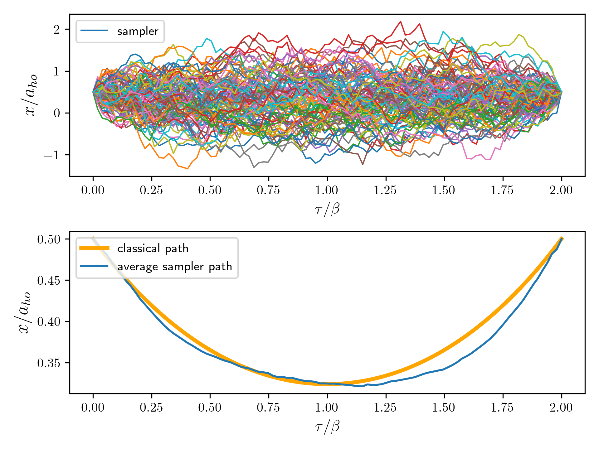
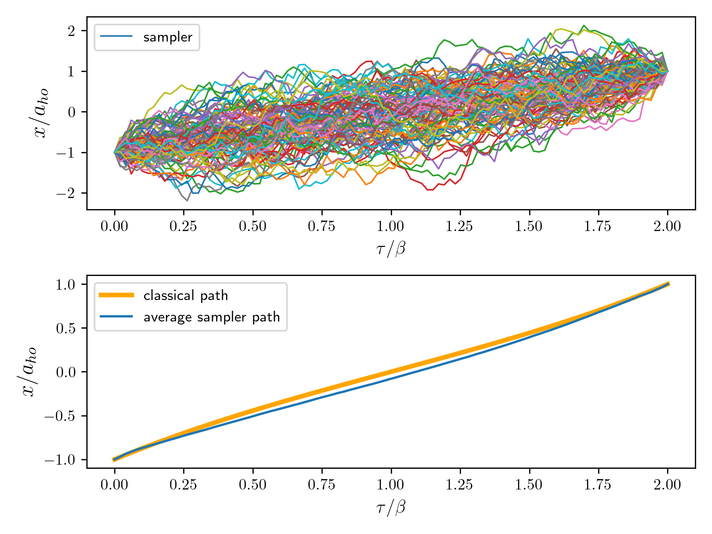
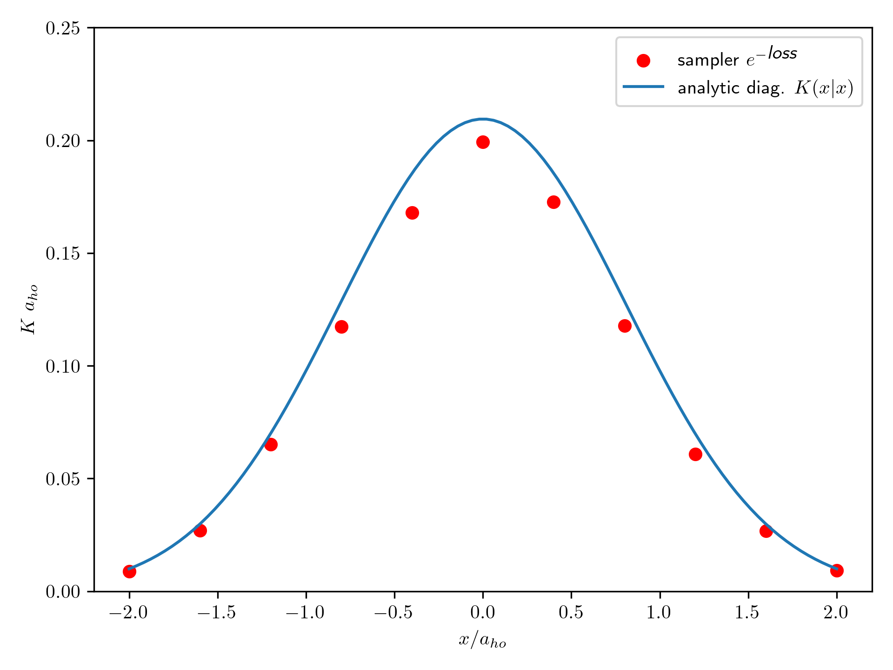

In this repository a reverse VAE architecture is used to sample paths of Euclidean propagators and estimate the partition function of 1D physical systems.
## VAE-path-integral-sampler

Two recent works have made significant progress towards sampling distributions of relevance to statistical physics with the help of ML and in particular variational inference and variational autoencoders. In [Y. Che et al., Phys. Rev. B 105, 214205](https://journals.aps.org/prb/abstract/10.1103/PhysRevB.105.214205) the authors show that it is possible sample Euclidean path integral propagators using a decoder-only architecture with a low-dimensional latent variable. In another recent work [G. Cantwell arXiv:2209.10423](https://arxiv.org/abs/2209.10423), the author shows that a reverse-VAE architecture can be used to learn distributions commonly found in physics where the distribution is known up to a normalization constant, providing an alternative to MCMC. Here, I will combine both ideas and apply the full encoder-decoder reverse VAE sampler from [arXiv:2209.10423] to the problem studied in [PRB 105, 214205]. As an illustration, a simple SHO system is analyzed. 

For a discretized path space $x=[x_0,x_1,x_2,...,x_{N_{T-1}}]$ with fixed boundary points $x_0$ and $x_{N_{T-1}}=x_f$ the propagator can be computed by:

$$
 K(x_f | x_0) = \left( \frac{m}{2 \pi \hbar dt} \right)^{(N_T-1)/2} \int dx_1 ... dx_{N_{T-2}} e^{ - \mathcal{S}[x]}.
$$
 

By defining the integrand of the propagator (including the constant) as $F(x)$ it is possible to write the upper bound on the negative log of the propagator as:

$$
-\log(K) \leq  \mathbb{E}_{z \sim P(z) , x\sim R(x|z)  } \left[  - \log(F(x)) - \log(Q(z|x) ) + \log (P(z) R(x|z)) \right] .
$$

As noted in [G. Cantwell arXiv:2209.10423](https://arxiv.org/abs/2209.10423) this expression can be interpreted as a reverse VAE, where starting from a latent sample $z$ from $P(z)$ the encoder generates a path $x_1,...,x_{N_T-2}$ which is then decoded back to $z$ by the decoder. In this repository, I will model $R(x|z)$ by an autoregressive LSTM similar to [A. Graves arXiv:1308.0850](https://arxiv.org/abs/1308.0850) where the output of one cell is considered as an input to the next cell.


## Setup
Clone repository:

```python
git clone git@github.com:TimourIc/vaepi-sampler
````

Create venv and activate:
 
```python
python -m venv venv
source venv/bin/activate
```

Install your package in editable mode (and use vaepi_sampler in scripts like a package):

```python
pip install -e .
```

To also use the scripts make sure to install all the requirements:

```python
pip install -r requirements.txt
```

## Usage

The main code is contained in the `vaepi_sampler` package. Some implementation to train the models and generate figures can be found in `scripts/`. To train the sampler for a Euclidean propagator (so far just an SHO) at temperature $T=\hbar \omega/k_b T_{max}$, discretization $N_T$ and end/final points X0/XF run:

```python
python scripts/train_propagator.py --T_MAX <T_max(float)> --N_T <N_T(int)> --X0 <X0(float)> --XF <XF(float)>
```


## Results

### Samples SHO

Below some results are shown for four propagator samplers at $N_T=100$ and $T_{max}=2$ for $(x_0, x_f)= (0.5,0.5)a_{ho}$. The top panels show a small batch of 100 samples generated with the trained model, whereas the bottom panels compare the average path of 50 000 samples with the classical path.  



and for $(x_0, x_f)= (-1,1)a_{ho}$:



### Values propagator

Note that when defined with the appropriate offset constants, the value of the loss function forms an upper bound for (negative log of) the propagator itself. Below we compare $e^{-\textit{loss}}$ for models trained to sample the diagonal with the actual propagator values for $T_{max}=2$.




If we compute the free energy or trace based on both plots then we find an error of ~10%, so some further fine-tuning should be done.

## To Do:

1) So far I have not looked in depth at the decoder part and whether any interesting structure between the latent space and the path space was learned.

2) There is still some fine-tuning to indicated by the small discrepancies with the analytic result.

3) The custom LSTM used here to make it fully auto-regressive (inspired by https://github.com/pytorch/pytorch/blob/main/benchmarks/fastrnns/custom_lstms.py) seems to be significantly slower than the standard pytorch LSTM, even with JIT scripting/cuda. Should look at how to speed it up.

4) In the current simple implementation $x_0$ and $x_f$ are not varied during training and hence separate training rounds are required. In next iterations this can of course be promoted to a conditional input for a single model. 

 

