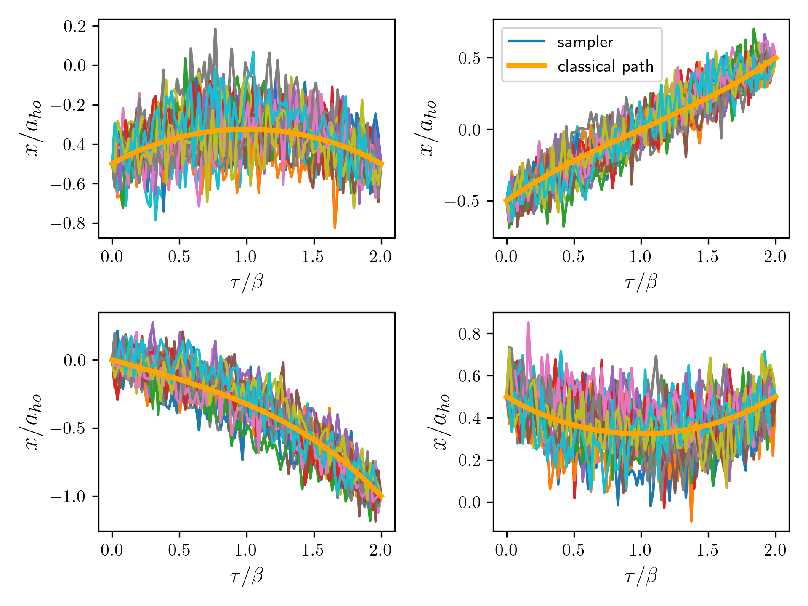

In this repository a reverse VAE architecture is used to sample Feynman paths and estimate the partition function of 1D physical systems.
## VAE-path-integral-sampler

Two recent works have made significant progress towards sampling distributions of relevance to statistical physics with the help of variational inference and variational autoencoders. In [Y. Che et al., Phys. Rev. B 105, 214205](https://journals.aps.org/prb/abstract/10.1103/PhysRevB.105.214205) the authors show that it is possible sample Euclidean path integral propagators using a decoder-only architecture with a low-dimensional latent varaible. In another recent work [G. Cantwell arXiv:2209.10423](https://arxiv.org/abs/2209.10423), the author shows that a reverse-VAE architecture can be used to learn distributions commonly found in physics where the distribution is known up to a normalization constant, providing an alternative to MCMC. Here, I will combine both ideas and apply the full encoder-decoder reverse VAE sampler from [arXiv:2209.10423] to the problem studied in [PRB 105, 214205]. As an illustration, a simple SHO system is analyzed.


## Setup
Clone repository:

```python
git clone git@github.com:TimourIc/vaepi-sampler
````

Create venv and activate:
 
```python
python -m venv venv
source venv/bin/activate
```

Install your package in editable mode (and use vae_path_generator in scripts like a real package):

```python
pip install -e .
```

To also use the scripts make sure to install all the requirements:

```python
pip install -r requirements.txt
```

## Usage

The main code is contained inte vaepi_sampler package. Some implementation is shown in `scripts/`. To train the sampler for a Euclidean propagator (SHO at temperature $T=\hbar \omega/k_b T_{max}$, discretization $N_T$ and end/final points X0/XF) run:

```python
python scripts/train_propagator.py --T_MAX <T_max(float)> --N_T <N_T(int)> --X0 <X0(float)> --XF <XF(float)>
```

## Results

Below some results are shown for four propagator samplers at $N_T=100$ and $T_{max}=2$: 




